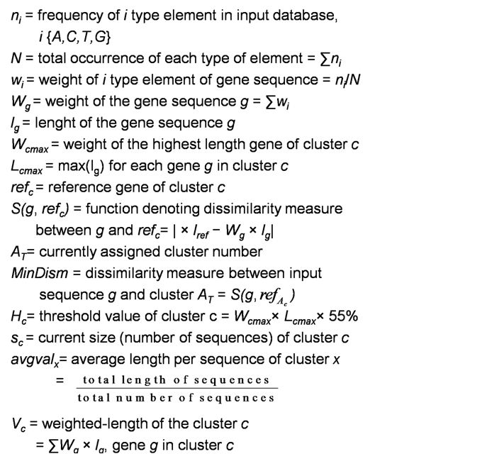
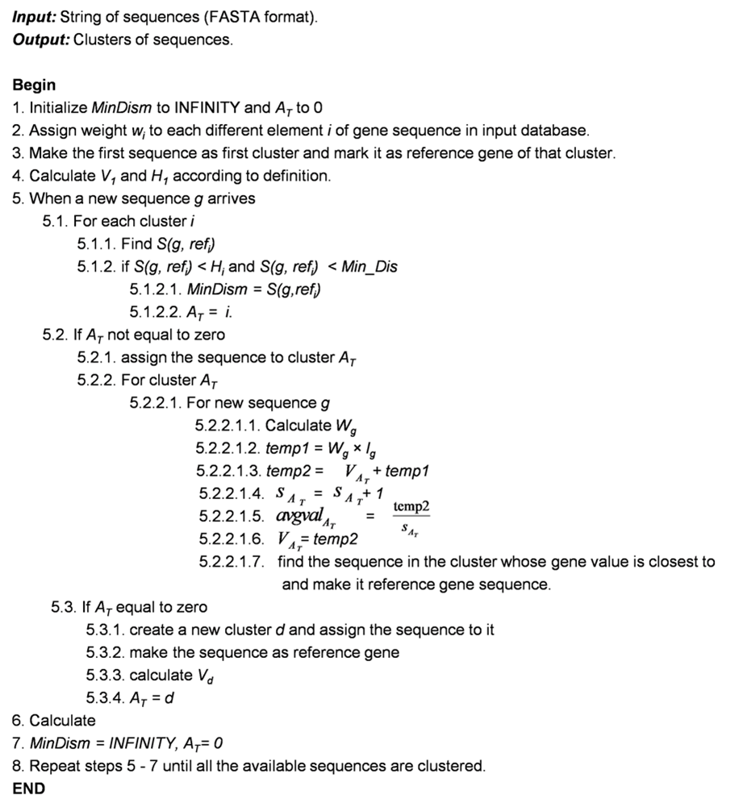

# DSP 539: Project
## A New Approach for Clustering of Gene Sequences

## ALGORITHM: RaTa

## Definition

## Method

### IMPLEMENTATION

#### Programming Language: Python
#### _Prerequisite_:
##### Python Packages: sys, pandas , numpy,math
##### Software: Anaconda (I used); You can choose any relevent software at your convenience
&nbsp;

### _How to run the program (Anaconda)_:
##### Go to Anaconda prompt and write  "python < FileName.py > < InputFileName.fasta >"
##### For example: python SeqCluster.py nd2-10.fasta
##### For running test go to command prompt and write "pytest" and then ENTER

### _GitHub Directory/File Structure_:
1. "Input" Folder: Input files are stored in this folder; Here file "nd2-10.fasta" means file with 10 sequences, similarly  "nd2-20.fasta" means file with 20 sequences and so on..
2. "Result" Folder: List of output files. Each file is generated with varying number of inputs sequences and threshold parameter in the code. Here file "0.05-80.txt" means file is generate after running code with threshold parameter = 0.05 and number_of_input_sequences = 80 and so on.
3. "Graph.xlsx" contains summary of all files in result folder draw graph with "number_of_input_sequences" in X-axix and "number_of_cluster" in y-axis according to different threshold valu4. Poster.pdf: Poster presentation of the project work
4. Poster.pdf: Poster presentation of the project work
5. SeqCluster.py: Python implementation of the algorithm

### _Code Description_:
#### File: SeqCluster.py 
##### Methods:
###### a. seq_weight(): 
         - calculate weight of the sequence based on frequency of the each base type
###### b. calculate_wl(): 
         - calculate weighted length of the cluster
###### c. sim(): 
         - Measure similarity between input sequence  and reference gene of the cluster 
###### d. closest():
         - find the position of gene with closest gene; find the position of the sequence in a cluster whose length  is closest to the average sequence length of the cluster
###### e. file_format_check():
         - check if the input DNA sequences contain characters from {A,C,T,G,R,Y,M}

##### Notes:
###### 1. Implementation of Algorithm Steps are commented in to "SeqCluster.py" file
###### 2. Code "R: in sequence means either "A" or "G"; Here "R" replaced by "A" arbitrarily
###### 3. Code "Y: in sequence means either "C" or "T"; Here "Y" replaced by "T" arbitrarily
###### 4. Code "M: in sequence means either "A" or "C"; Here "M" replaced by "C" arbitrarily
###### Reference: Fasta Code Meaning, <http://www.boekhoff.info/dna-fasta-codes/>
